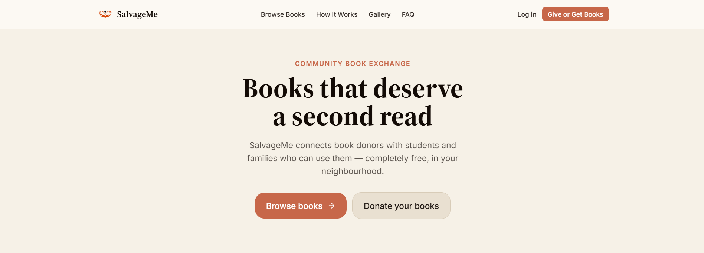

# SalvageMe — Frontend Monorepo



A community book exchange platform connecting book donors with students and families in Ghana —
free, peer-to-peer, no middlemen. This repo is a pnpm workspace containing two independent React +
Vite applications:

| Artifact | Path | Purpose |
|---|---|---|
| **SalvageMe** | `artifacts/salvageme/` | Public-facing book exchange app |
| **SalvageMe Admin** | `artifacts/salvageme-admin/` | Internal admin panel for moderators |

Both talk to the same external Django REST API at `https://salvageme.pythonanywhere.com/api/v1`.
`API_REFERENCE.md` in this repo is the hand-written contract that both frontends were built against.

---

## Stack

- **Monorepo**: pnpm workspaces, Node.js 24, TypeScript 5.9
- **Both apps**: React 18, Vite 7, Tailwind CSS v4 (CSS-first — design tokens live in each app's
  `src/index.css`, there is no `tailwind.config.js`)
- **Routing**: Wouter v3
- **State**: Zustand (auth session, toast notifications)
- **Data fetching**: TanStack React Query v5
- **Forms**: React Hook Form + Zod + `@hookform/resolvers`
- **Icons**: Lucide React
- **Image compression**: `browser-image-compression` (salvageme only)

---

## Requirements

- Node.js 24
- **pnpm only** — a `preinstall` script blocks `npm install`/`yarn install` and refuses to run.
  Install pnpm globally (`npm install -g pnpm`) before doing anything else in this repo.

---

## Setup

```bash
pnpm install
```

### Running the public app

```bash
pnpm --filter @workspace/salvageme run dev
# → http://localhost:3000
```

### Running the admin app

```bash
pnpm --filter @workspace/salvageme-admin run dev
# → http://localhost:3001/salvageme-admin/
```

Both dev scripts set `PORT` and `BASE_PATH` via `cross-env` so no extra environment setup is needed
locally. On Replit, `PORT` and `BASE_PATH` are injected automatically by the workflow system.

**Running from the repo root**: `pnpm run dev` at the root is a shortcut that runs both apps. To
target one specifically, use the `--filter` flag shown above or `cd` into the artifact directory
and run `pnpm run dev` directly.

### Windows notes

- If `preinstall` fails with `'sh' is not recognized`, point npm/pnpm at Git Bash's shell once:
  add `script-shell=C:/Program Files/Git/bin/bash.exe` to your user `.npmrc`
  (`C:\Users\<you>\.npmrc`), or run `pnpm config set script-shell "C:/Program Files/Git/bin/bash.exe"`.
- Once that's set, all pnpm scripts run through Git Bash's MSYS layer, which auto-converts
  Unix-style path arguments. If you see the dev server come up at a mangled URL, set
  `MSYS_NO_PATHCONV=1` as a permanent user environment variable.
- Rollup, esbuild, lightningcss, and `@tailwindcss/oxide` ship OS-specific native binaries. This
  repo's `pnpm-workspace.yaml` excludes platform binaries the Replit deploy target doesn't need,
  but keeps `win32-x64` enabled for local Windows development. If you're on `arm64` Windows,
  re-enable the corresponding `win32-arm64` override entries yourself.

---

## Environment variables

### `artifacts/salvageme` — public app

Set in `artifacts/salvageme/.env` (or `.env.local`, `.env.<mode>` — standard Vite loading rules).

| Variable | Purpose |
|---|---|
| `VITE_API_MODE` | `"mock"` (default) — in-memory dataset, no network calls. `"live"` — hits the real Django backend. |
| `VITE_API_BASE_URL` | Base URL of the Django API, including `/api/v1`. Defaults to `https://salvageme.pythonanywhere.com/api/v1`. |

### `artifacts/salvageme-admin` — admin app

Set in `artifacts/salvageme-admin/.env` (same Vite loading rules).

| Variable | Purpose |
|---|---|
| `VITE_API_BASE_URL` | Base URL of the Django API. Defaults to `https://salvageme.pythonanywhere.com/api/v1`. |

The admin app has no mock mode — it always calls the live API. Admin access is gated by the Django
backend: only accounts with an assigned admin role (`canAccessAdmin: true`) can log in.

**CORS gotcha**: the Django backend must have your dev origin in `CORS_ALLOWED_ORIGINS` (and
`CORS_ALLOW_CREDENTIALS = True`) before API calls will work locally or on Replit. The API client
sends `credentials: "include"` on every request (cookie-based refresh token), which prevents Django
from using a wildcard `*` origin.

---

## Swapping the mock adapter for the live API (public app only)

All data access in `artifacts/salvageme` goes through `src/lib/api-client.ts`, which exports a
single `apiClient` implementing the `ApiAdapter` interface. Two implementations exist:

- `mockAdapter` (`src/lib/mock-adapter.ts`) — in-memory, seeded sample data, used by default.
- `createLiveAdapter(baseUrl, healthBaseUrl)` — real `fetch` calls to the Django API, converting
  between snake_case wire format and the app's camelCase types, with automatic silent-refresh on 401s.

No component or page imports either directly — they all import `apiClient`, so switching modes is
purely an environment-variable change (`VITE_API_MODE=live`).

---

## Scripts

```bash
# Public app
pnpm --filter @workspace/salvageme run dev          # local dev server (port 3000)
pnpm --filter @workspace/salvageme run build        # production build → dist/public
pnpm --filter @workspace/salvageme run serve        # preview a production build locally
pnpm --filter @workspace/salvageme run typecheck    # tsc --noEmit

# Admin app
pnpm --filter @workspace/salvageme-admin run dev       # local dev server (port 3001, base /salvageme-admin/)
pnpm --filter @workspace/salvageme-admin run build     # production build → dist/public
pnpm --filter @workspace/salvageme-admin run typecheck # tsc --noEmit

# Workspace-wide
pnpm run build       # typecheck + build all artifacts
pnpm run typecheck   # typecheck all packages
```

---

## Project structure

```
artifacts/
  salvageme/                  ← Public-facing React + Vite app
    src/
      pages/                  ← Route-level page components
      components/
        ui/                   ← Custom UI primitives (Button, Card, Badge, Modal, Toast…)
        layout/               ← SiteHeader, SiteFooter, NavigationProgress
        listings/             ← ListingCard, ListingFilters, PhotoPicker, ReportButton…
        gallery/              ← GalleryGrid
      lib/
        api-client.ts         ← API adapter (mock ↔ live toggle)
        mock-adapter.ts       ← In-memory mock dataset
        auth.ts               ← bootstrapSession, login, register, logout
        stores/               ← Zustand stores (session-store, toast-store)
        content/gallery.ts    ← Static gallery items
      types/index.ts          ← All domain types (Listing, Exchange, User…)
      App.tsx                 ← Router, QueryClient, AuthGuard, ScrollToTop
      index.css               ← Tailwind v4 @theme tokens (palette, fonts, sizes)
    public/
      logo.png
      gallery/                ← Sample impact photos

  salvageme-admin/            ← Internal admin panel (separated from public app in v2)
    src/
      pages/                  ← One page per admin capability
        LoginPage.tsx
        AdminDashboardPage.tsx
        AdminUsersPage.tsx
        AdminListingsPage.tsx
        AdminReportsPage.tsx
        AdminRequestsPage.tsx
        AdminExchangesPage.tsx
        AdminRatingsPage.tsx
        AdminCategoriesPage.tsx
        AdminDropoffPointsPage.tsx
        AdminPartnerApplicationsPage.tsx
        AdminRolesPage.tsx
        AdminAuditLogPage.tsx
      components/
        ui/                   ← Custom UI primitives (shared visual language with public app)
        AdminLayout.tsx        ← Sidebar navigation + mobile drawer
        StatCard.tsx
      lib/
        api-client.ts         ← Admin-specific API client (always live, no mock mode)
        auth.ts               ← Admin login / token refresh / logout
        stores/               ← Zustand stores (admin-store, toast-store)
      types/index.ts          ← Domain types + admin-only types (AdminUser, AdminReport…)
      App.tsx                 ← Router, AdminGuard, capability-based route protection
      index.css               ← Tailwind v4 @theme tokens (same palette as public app)
    public/
      logo.png                ← Shared logo asset

lib/
  api-zod/                    ← Shared Zod schemas / generated types
  api-spec/                   ← OpenAPI schema for the Django backend
  db/                         ← Drizzle ORM schema + Postgres connection
scripts/                      ← Workspace-level dev/CI scripts
```

---

## Design system

Design tokens (palette, fonts, spacing, radii) live entirely in the `@theme inline` block inside
each app's `src/index.css` — there is no `tailwind.config.js`. Both apps share the same visual
language (terracotta accent, paper background, ink text scale). UI primitives are hand-rolled under
`components/ui/` rather than using shadcn, to avoid TypeScript casing-collision issues on
case-insensitive filesystems (filenames are PascalCase: `Button.tsx`, not `button.tsx`).

---

## Product

### Public app (`artifacts/salvageme`)

Two user roles — **donors** and **recipients** — covering the full exchange lifecycle:

| Screen | Path |
|---|---|
| Home | `/` |
| Browse books | `/listings` |
| Book detail + request | `/listings/:id` |
| New listing (3-step form) | `/listings/new` |
| Edit / delete listing | `/listings/:id/edit` |
| My dashboard | `/dashboard` |
| Exchanges | `/exchanges`, `/exchanges/:id` |
| Requests (incoming + sent) | `/requests` |
| Profile settings | `/settings` |
| How it works | `/how-it-works` |
| Gallery | `/gallery` |
| FAQ | `/faq` |

### Admin app (`artifacts/salvageme-admin`)

Access is restricted to accounts with an admin role assigned on the backend. The app uses a
capability system — each nav item is hidden unless the logged-in admin has the required capability.

| Screen | Capability |
|---|---|
| Dashboard (overview stats) | `dashboard.view` |
| Reports | `reports.view` |
| Users | `users.view` |
| Listings | `listings.view` |
| Exchanges | `exchanges.view` |
| Requests | `requests.view` |
| Ratings | `ratings.view` |
| Categories | `categories.manage` |
| Drop-off Points | `dropoff.view` |
| Partner Applications | `partner_applications.review` |
| Audit Log | `auditlog.view` |
| Roles | `roles.manage` |

---

## Architecture notes

- **Monorepo separation (v2)**: The admin panel was originally co-located with the public app and
  has been split into its own independent artifact (`artifacts/salvageme-admin`). Each artifact is
  a completely self-contained Vite project with its own `package.json`, `tsconfig.json`,
  `vite.config.ts`, and `src/` tree. They share no workspace-internal packages — only npm
  dependencies and the Django API contract.
- **Wouter, not a Next.js router** — both apps were migrated off Next.js/Vercel onto Vite; routing
  uses Wouter v3 (`<Link>`, `useLocation`, `useSearch`, `useParams`).
- **AuthGuard / AdminGuard** replace Next.js middleware — guards read Zustand session state and
  redirect unauthenticated or unauthorised users accordingly.
- **Admin BASE_PATH** — the admin app is served at `/salvageme-admin/` (not `/`). Vite's `base`
  config reads `BASE_PATH` from the environment (injected by the artifact workflow system on Replit,
  set via `cross-env` locally). All internal links and router hrefs are relative, so the base is
  transparent to page code.
- **ScrollToTop** is wired into the Wouter `<Router>` in both apps and calls
  `window.scrollTo({ top: 0, behavior: "instant" })` on every location change.
- **Impact/activities gallery has no backend or self-serve upload yet** — `src/lib/content/gallery.ts`
  plus static files in `public/gallery/` are editable config in the public app. Adding a real photo
  currently requires a code change and redeploy.

---

## Gotchas

- **CORS in dev** — use `VITE_API_MODE=mock` locally for the public app unless the backend has
  whitelisted your origin. The admin app has no mock mode — it will show CORS errors until the
  Replit dev domain is added to the Django backend's `CORS_ALLOWED_ORIGINS`.
- **`PORT` and `BASE_PATH` are required** — `vite.config.ts` in both apps throws on startup if
  either is unset. The `dev` scripts set both via `cross-env`; if you're running `vite` directly,
  set them yourself.
- **PascalCase UI components** — `components/ui/` in both apps uses PascalCase filenames
  (`Button.tsx`, not `button.tsx`). `forceConsistentCasingInFileNames` is enabled in
  `tsconfig.base.json`; lowercase imports will fail the build.
- **Admin-only `AuthTokens` type** — `AuthTokens` is defined in each app's own `types/index.ts`
  independently. It is not shared via a workspace package.

---

## Deploying to Firebase Hosting

Both apps are client-side Vite SPAs (Wouter routing, no SSR), so they deploy as static files via
**Firebase Hosting**.

### One-time setup

```bash
pnpm add -D -w firebase-tools
pnpm exec firebase login
pnpm exec firebase use --add   # link this repo to your Firebase project
```

`firebase.json` at the repo root is already configured with two hosting targets — one for each app:

```json
{
  "hosting": [
    {
      "target": "salvageme",
      "public": "artifacts/salvageme/dist/public",
      "rewrites": [{ "source": "**", "destination": "/index.html" }]
    },
    {
      "target": "salvageme-admin",
      "public": "artifacts/salvageme-admin/dist/public",
      "rewrites": [{ "source": "**", "destination": "/index.html" }]
    }
  ]
}
```

### Set the production API mode (public app)

Vite bakes `VITE_*` env vars into the build at build time. Create
`artifacts/salvageme/.env.production` (gitignored):

```
VITE_API_MODE=live
```

Add `VITE_API_BASE_URL` too if you're not using the default backend URL. Before this works in
production, the Django backend needs your Firebase Hosting domain added to `CORS_ALLOWED_ORIGINS`.

### Build and deploy

```bash
pnpm install
pnpm --filter @workspace/salvageme run build
pnpm --filter @workspace/salvageme-admin run build
pnpm exec firebase deploy --only hosting
```

### Optional: auto-deploy on push

`firebase init hosting:github` scaffolds a GitHub Actions workflow. Since this is a pnpm workspace,
edit the generated workflow to install with `pnpm install` and build both artifacts with the
`--filter` flags above instead of the default `npm ci && npm run build`.

---

## Contributing

See `API_REFERENCE.md` for the backend contract both frontends integrate against.
